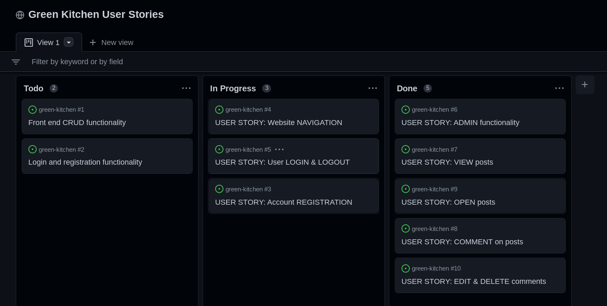
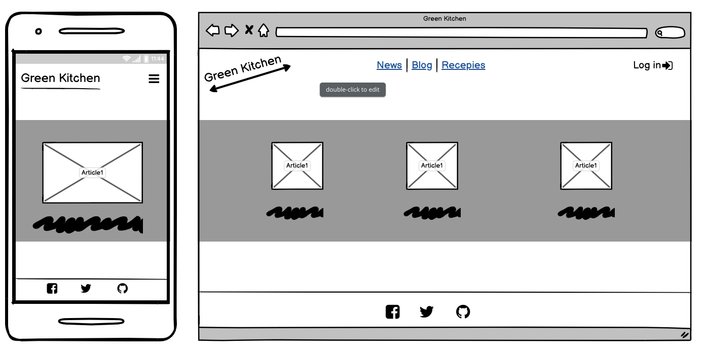

# Green Kitchen

! NOTE: Green Kitchen project is still in its sprouting phase. After leave of absence ended, i was given access to LMS again and 10 days for late submission of PP4. Due to short time allocated, unfortunately i could not process study material and make project on time, although im very happy with my personal progress and understanding of coding, and im starting to have much more fun :D looking forward to resubmit it proper! thank you

! Project was based on unfinished template of module 'I think therefore i blog' from CI, all credits to it

 
Link to the live website: [Green Kitchen](https://green-kitchen.herokuapp.com/)

## Table of contents

1. [Introduction](#Introduction)
2. [UX](#UX)
    - [User Stories](#User-Stories)
    - [Design](#Design)
    - [Wireframes](#Wireframes)
3. [Features](#Features)
    - [Design Features](#Design-Features) 
    - [Existing Features](#Existing-Features)
    - [Features to Implement in the future](#Features-to-Implement-in-the-future)
4. [Issues and Bugs](#Issues-and-Bugs)
5. [Technologies Used](#Technologies-Used)
     - [Languages Used](#Languages-Used)
     - [Frameworks, Libraries & Programs Used](#Frameworks,-Libraries-&-Programs-Used)
6. [Testing](#Testing)
7. [Deployment](#Deployment)
     - [Deploying on Heroku](#Deploying-on-Heroku)
8. [Credits](#Credits)
9. [Acknowledgements](#Acknowledgements)

## Introduction

Green Kitchen is place where progressive ideas cook. Topics of health, self-awareness, sustainability. Ancient wisdom is always just taking new forms. We are in a constant dialogue of the past, present and future.

Site concept is a personal blog with news section and a recipe page. Users can participate in comments on posts and news articles, with ability to like, upvote or downvote. They can also post recipes on recipe page.

All activities are supervised by admin which can delete comments or remove posts, post new blogs, etc..

## UX 

### User Stories

 

### Wireframes

 

## Features

## Issues and Bugs

## Technologies Used

### Languages used

- [HTML5](https://en.wikipedia.org/wiki/HTML5)
- [CSS3](https://en.wikipedia.org/wiki/Cascading_Style_Sheets)
- [Javascript](https://en.wikipedia.org/wiki/JavaScript)
- [Python](https://www.python.org/)

### Frameworks, libraries and programs used

- [Git](https://git-scm.com/)
- [GitHub](https://github.com/)
- [Gitpod](https://www.gitpod.io/)
- [Django](https://www.djangoproject.com/)
- [Bootstrap](https://getbootstrap.com/)
- [Google Fonts](https://fonts.google.com/)
- [Font Awesome](https://fontawesome.com/)
- [Google Developer Tools](https://developers.google.com/web/tools/chrome-devtools)
- [Cloudinary](https://cloudinary.com/)
- [PostgreSQL](https://www.postgresql.org/)
- [Balsamiq](https://balsamiq.com/)
- [Summernote](https://summernote.org/)
- [Heroku](https://www.heroku.com/)

## Deployment

## Credits

! Project was based on unfinished template of module 'I think therfore i blog' from CI, all credits to it

## Acknowledgements

Thank you for your time!

Green Kitchen - Powered by plants
