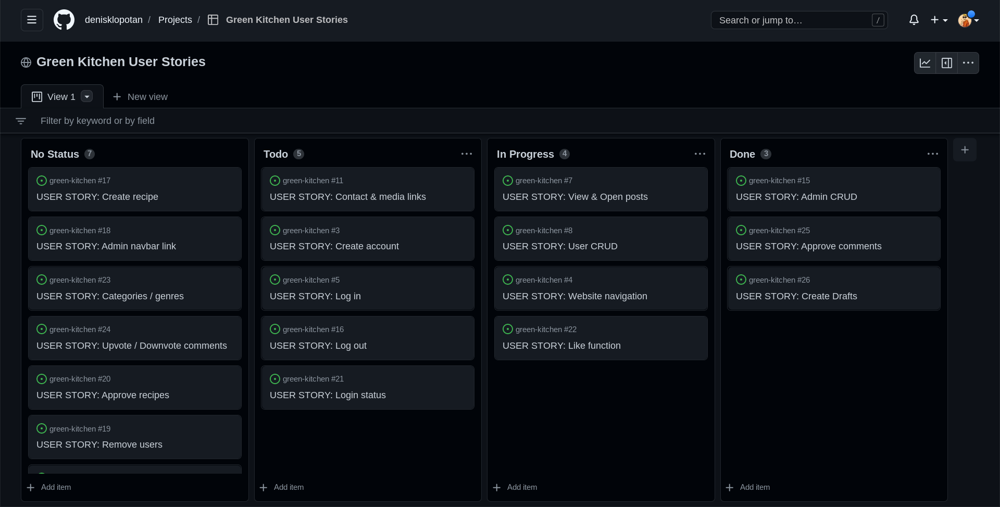
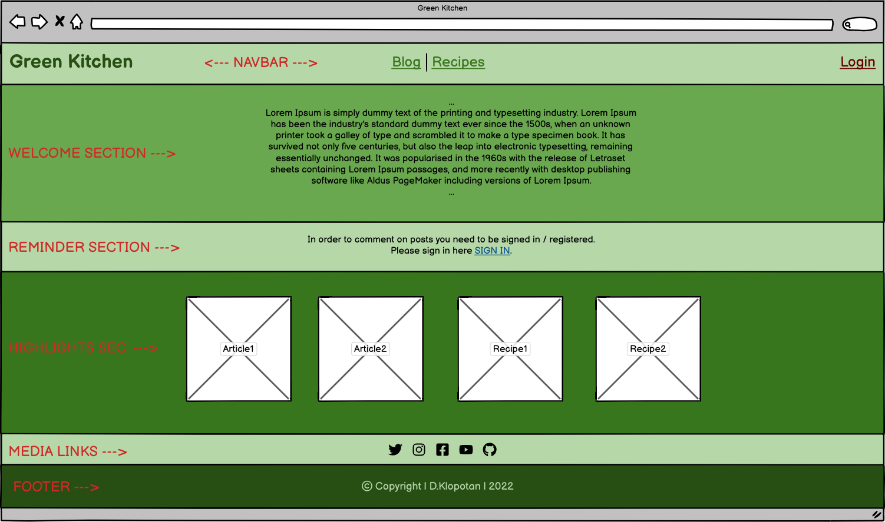
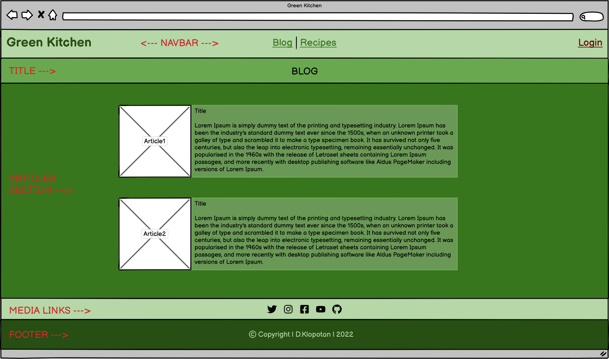
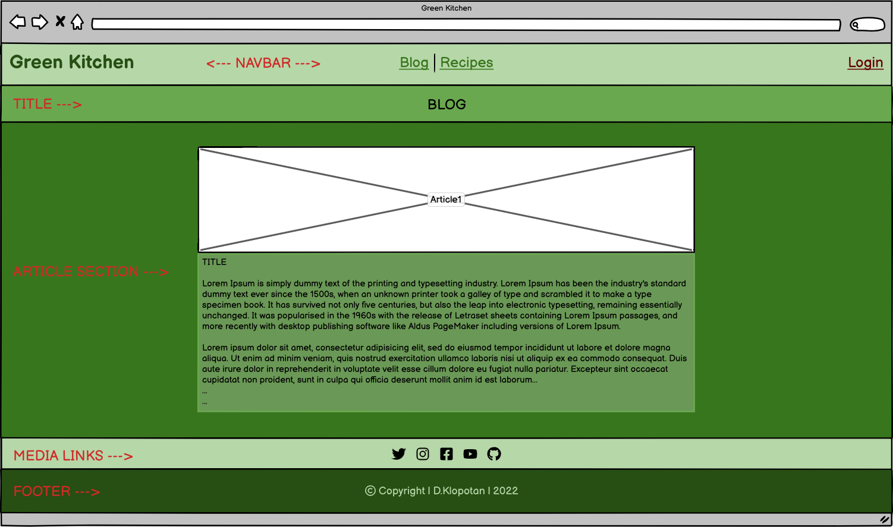
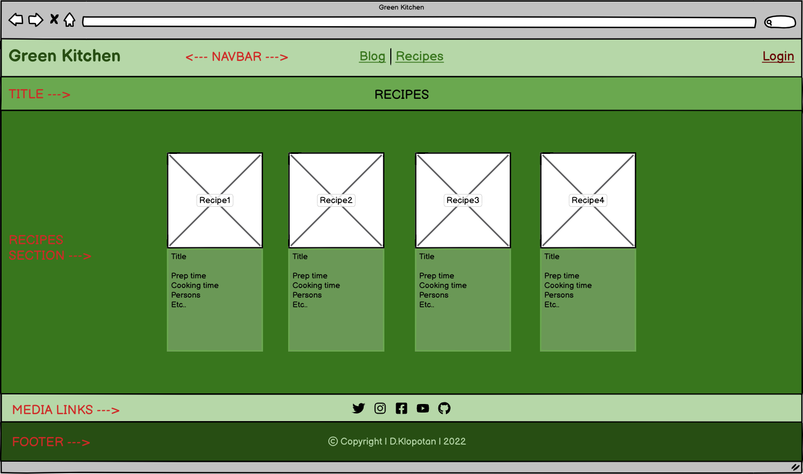
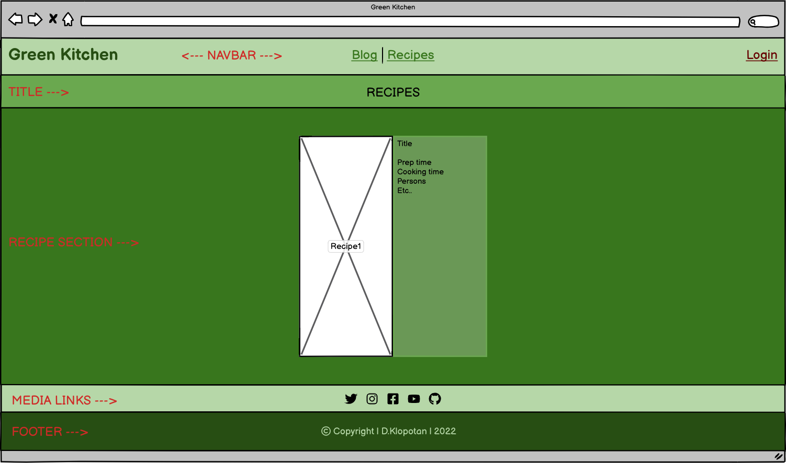
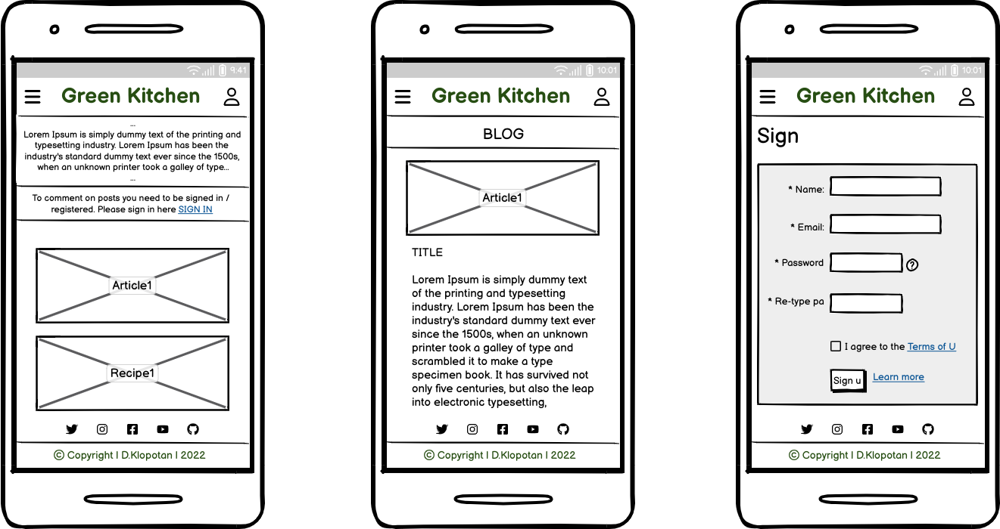
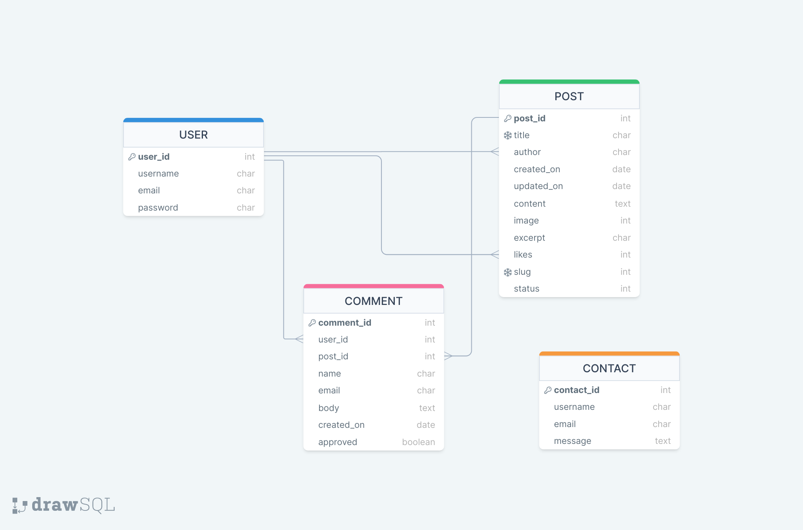

# Green Kitchen

Portfolio Project 4: Full-Stack Toolkit

 
Link to the live website: [Green Kitchen](https://green-kitchen.herokuapp.com/)

## Table of contents

1. [Introduction](#Introduction)
2. [UX](#UX)
    - [User Stories](#User-Stories)
    - [Design](#Design)
    - [Wireframes](#Wireframes)
3. [Features](#Features)
    - [Design Features](#Design-Features) 
    - [Existing Features](#Existing-Features)
    - [Features to Implement in the future](#Features-to-Implement-in-the-future)
4. [Issues and Bugs](#Issues-and-Bugs)
5. [Technologies Used](#Technologies-Used)
     - [Languages Used](#Languages-Used)
     - [Frameworks, Libraries & Programs Used](#Frameworks,-Libraries-&-Programs-Used)
6. [Testing](#Testing)
7. [Deployment](#Deployment)
     - [Deploying on Heroku](#Deploying-on-Heroku)
8. [Credits](#Credits)
9. [Acknowledgements](#Acknowledgements)

## Introduction

Green Kitchen is place where progressive ideas cook. Topics of health, self-awareness, sustainability. Ancient wisdom is always just taking new forms. We are in a constant dialogue of the past, present and future.

Site concept is a personal blog with news section and a recipe page. Registered users can participate by commenting on posts and news articles, adding recipes, editing and deleting comments, contacting site admin trough contact form, etc..

Elements implemented so far are personal blog with posts. Registered users can comment on posts or like posts. Admin can create posts, approve / delete comments or remove users.

## UX 

### User Stories

Users stories where created following agile development principles. Platform for creation was Github projects where we used Kanban board to add and organise user storiesuntil completion. Most user stories where realised while some where discontinued and some issues where left open as more relevant for continuation. Link to Github projects: [Green Kitchen User Stories](https://github.com/users/denisklopotan/projects/1)

 

### Wireframes

These wireframes are intial vision of project that turned out to be much simpler. Nevertheless i attach them here as guidance for future work and updates.

I put more love in these wireframes than in any wireframes before! For making them [Balsamiq](https://balsamiq.com/) was used which i explored in more details on this occasion which was fun!

HOMEPAGE

 

 
BLOG SECTION

 
OPEN POST

 
RECIPES SECTION

 
OPEN RECIPE

 
LOGIN

 
MOBILE DEVICES

## Database Schema

## Features

## Issues and Bugs

## Technologies Used

### Languages used

- [HTML5](https://en.wikipedia.org/wiki/HTML5)
- [CSS3](https://en.wikipedia.org/wiki/Cascading_Style_Sheets)
- [Javascript](https://en.wikipedia.org/wiki/JavaScript)
- [Python](https://www.python.org/)

### Frameworks, libraries and programs used

- [Git](https://git-scm.com/)
- [GitHub](https://github.com/)
- [Gitpod](https://www.gitpod.io/)
- [Heroku](https://www.heroku.com/)
- [Django](https://www.djangoproject.com/)
- [Bootstrap](https://getbootstrap.com/)
- [Google Fonts](https://fonts.google.com/)
- [Font Awesome](https://fontawesome.com/)
- [Balsamiq](https://balsamiq.com/)
- [drawSQL](https://drawsql.app/)
- [PostgreSQL](https://www.postgresql.org/)
- [Google Developer Tools](https://developers.google.com/web/tools/chrome-devtools)

### Django packages

- [Gunicorn](https://gunicorn.org/) as a web server for Heroku
- [Cloudinary](https://cloudinary.com/) to host static files and media
- [Dj_database_url](https://pypi.org/project/dj-database-url/) dealing with environment variables..
- [Psycopg2](https://pypi.org/project/psycopg2/) is PostgreSQL database adapter for the Python
- [Summernote](https://summernote.org/) as text editor
- [Allauth](https://django-allauth.readthedocs.io/en/latest/installation.html) for authentication, registration & account management
- [Crispy Forms](https://django-crispy-forms.readthedocs.io/en/latest/) for styling Django forms

## Testing

...

## Deployment

To create the project i followed LMS walktrough of module: 'I Think Therefore I Blog'. We firstly created Github project repository by using default CI 'gitpod-full-template'.
Alongside i used provided cheat sheets with instructions for seting up basic django project in Gitpod enviroment and how to deploy on Heroku. I will provide instructions here:

### Setting up basic Django Project and Deploying to Heroku

#### Step 1: Installing Django and supporting libraries

In the Terminal:

<table>
    <tr>
        <th>#</th>
        <th>Step</th>
        <th>Code</th>
    </tr>
    <tr>
        <td>1.</td>
        <td>Install Django and gunicorn:</td>
        <td>pip3 install 'django<4' gunicorn</td>
    </tr>
    <tr>
        <td>2.</td>
        <td>Install supporting libraries:</td>
        <td>pip3 install dj_database_url psycopg2</td>
    </tr>
    <tr>
        <td>3.</td>
        <td>Install Cloudinary Libraries</td>
        <td>pip3 install dj3-cloudinary-storage</td>
    </tr>
        <tr>
        <td>4.</td>
        <td>Create requirements file</td>
        <td>pip3 freeze --local > requirements.txt</td>
    </tr>
        <tr>
        <td>5.</td>
        <td>Create Project (codestar 2021)</td>
        <td>django-admin startproject PROJ_NAME . (Don’t forget the . )</td>
    </tr>
        <tr>
        <td>6.</td>
        <td>Create App (blog)</td>
        <td>python3 manage.py startapp APP_NAME</td>
    </tr>
</table>

settings.py:

<table>
    <tr>
        <th>#</th>
        <th>Step</th>
        <th>Code</th>
    </tr>
    <tr>
        <td>7.</td>
        <td>Add to installed apps</td>
        <td>INSTALLED_APPS = [ … 'APP_NAME', ]
</td>
    </tr>
    <tr>
        <td>*</td>
        <td>Save file</td>
        <td></td>
    </tr>
</table>

In the Terminal:

<table>
    <tr>
        <th>#</th>
        <th>Step</th>
        <th>Code</th>
    </tr>
    <tr>
        <td>8.</td>
        <td>Migrate Changes</td>
        <td>python3 manage.py migrate</td>
    </tr>
    <tr>
        <td>9.</td>
        <td>Run Server to Test</td>
        <td>python3 manage.py runserver</td>
    </tr>
</table>

#### Step 2: Deploying an app to Heroku

4 stages:

1. Create the Heroku app
2. Attach the database
3. Prepare our environment and settings.py file
4. Get our static and media files stored on Cloudinary

Note: Error fix

If you get the error below during the steps to deployment:

django.db.utils.OperationalError: FATAL: role "somerandomletters" does not exist

Please run the following command in the terminal to fix it:

unset PGHOSTADDR

2.1 Create the Heroku app

... to be continued

## Credits

### Content

Content for blog posts was taken from Anthony William's (Medical Medium) webpage: https://www.medicalmedium.com/

### Media

...

### Code

Project is based on LMS module template: 'I Think Therefore I Blog'.

I was mainly inspired and learnt trough LMS modules, slack and other students project examples.
Going trough different project codes and seeing similar patterns over and over again made me grasp things better.

OF special help i found following project (maby cause they where on top of page hehe):

- https://github.com/AliOKeeffe/PP4_My_Meal_Planner
- https://github.com/Delboy/EatMe
- https://github.com/cornishcoder1/the_paper_lounge

Aditional credits:

- https://docs.djangoproject.com/

## Acknowledgements

Let me say something first, not just help, but i got many many good memories with all of you! :D
CI team, tutors with their: 'Happy coding' quotes at the end of my exhausting days that bright me up :)
Student support Kieron and Bethany which i had priviledge to talk to and share my worries hehe.
With Kieron i talked so many times that it must be karma! Loads of help from them.
My mentor Jack, good spirit all this time and very intuitive when listening and offering solutions.
Mentor Daisy which assisted me on saturday evening when i thought nobody will..
She shared with me valuable story of tough beginnings with coding, i understood im not the only one.
Slack community, i wish i was there for them as much as they where for me.. Maby one day i can be knowledgable enough...

Life goes so fast, in that rush you sometimes forget to reflect back and remember all that helped you,
SO thats why this time i start and finish this readme with many many thanks!

And to you reading.. Thank you, and.... HAPPY CODING ! :D
