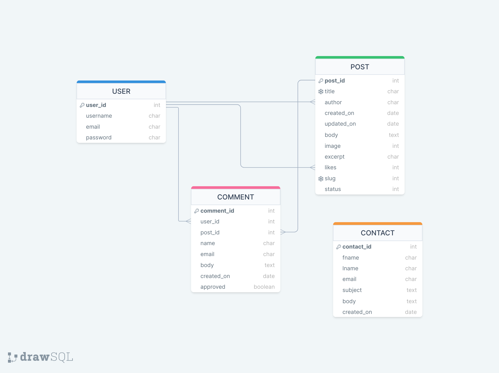
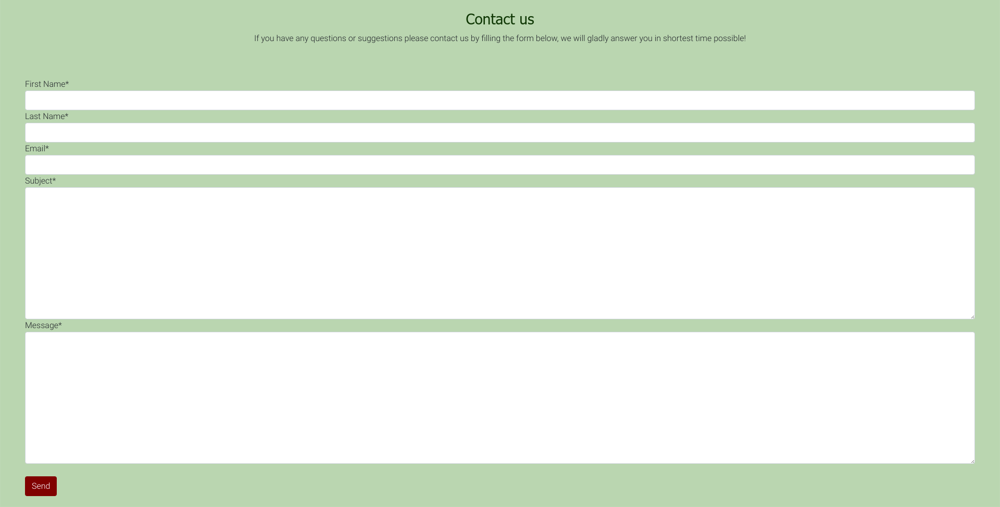
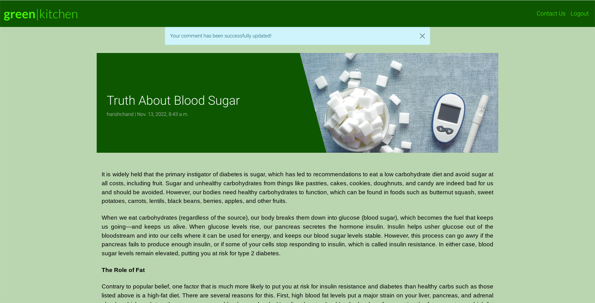
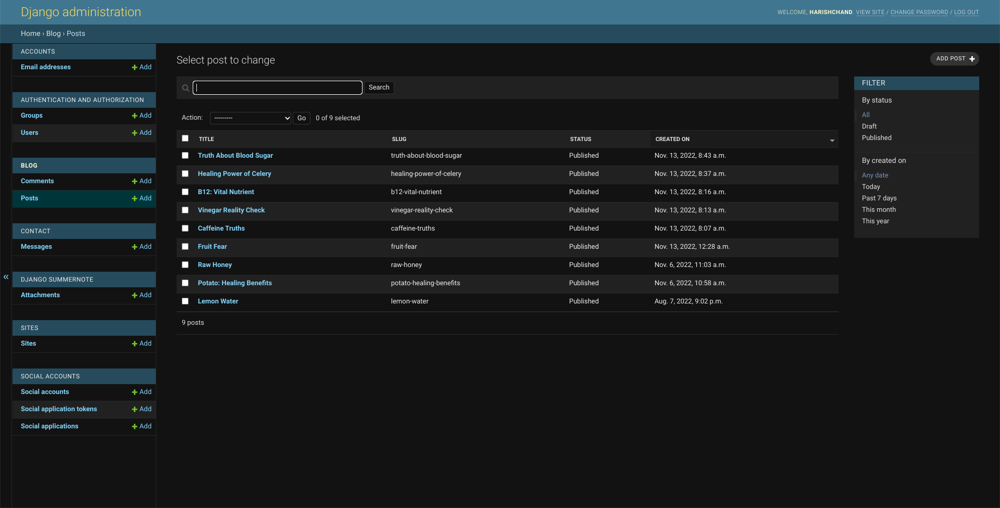

# Green Kitchen

Portfolio Project 4: Full-Stack Toolkit

 
Link to the live website: [Green Kitchen](https://green-kitchen.herokuapp.com/)

## Table of contents

1. [Introduction](#Introduction)
2. [UX](#UX)
    - [User Stories](#User-Stories)
    - [Design](#Design)
    - [Wireframes](#Wireframes)
3. [Features](#Features)
    - [Design Features](#Design-Features) 
    - [Existing Features](#Existing-Features)
    - [Features to Implement in the future](#Features-to-Implement-in-the-future)
4. [Issues and Bugs](#Issues-and-Bugs)
5. [Technologies Used](#Technologies-Used)
     - [Languages Used](#Languages-Used)
     - [Frameworks, Libraries & Programs Used](#Frameworks,-Libraries-&-Programs-Used)
6. [Testing](#Testing)
7. [Deployment](#Deployment)
     - [Deploying on Heroku](#Deploying-on-Heroku)
8. [Credits](#Credits)
9. [Acknowledgements](#Acknowledgements)

## Introduction

Green Kitchen is place where progressive ideas cook. Topics of health, self-awareness, sustainability. Ancient wisdom is always just taking new forms. We are in a constant dialogue of the past, present and future.

Site concept is a personal blog with news section and a recipe page. Registered users can participate by commenting on posts and, editing and deleting comments, contacting site admin trough contact form.

## UX 

### User Stories

Users stories where created following agile development principles. Platform for creation was Github projects where we used Kanban board to add and organise user storiesuntil completion. Most user stories where realised while some where discontinued and some issues where left open as more relevant for continuation. Link to Github projects: [Green Kitchen User Stories](https://github.com/users/denisklopotan/projects/1)

 

### Wireframes

These wireframes are intial vision of project that turned out to be much simpler. Nevertheless i attach them here as guidance for future work and updates.

I put more love in these wireframes than in any wireframes before! For making them [Balsamiq](https://balsamiq.com/) was used which i explored in more details on this occasion which was fun!

HOMEPAGE

 

 
BLOG SECTION

 
OPEN POST

 
RECIPES SECTION

 
OPEN RECIPE

 
LOGIN

 
MOBILE DEVICES

## Database Schema

## Features

### Homepage

Main page wih navbar, welcome text and paginated list of posts

### Navbar button

On mobile devices navbar collapses into button which we can press and open menu with links

### Contact form

We implemented a custom model to send user data to database

### Authentication

Sign Up

Sign In

Sign Out

### Comments

Authenticated user can create coments and update and delete their own comments, but not comments from other users.

Leave comment

Edit comment

Delete comment

After commenting we can see alert message : comment is waiting approval.

### Post

Individual posts open i their own respective page.

### Footer, reminder and page buton

Above the footer you can see message reminder for user to register in order to use CRUD. With provided links.
There is also a button to acess next paginated page of posts. There is maximum 6 posts per page.

### Admin

Admin panel is working properly. As admin we have full CRUD to manage user accounts, posts, comments, user messages..

## Issues and Bugs

There where no known bugs at the time deployment, ones during development where fixed.

## Technologies Used

### Languages used

- [HTML5](https://en.wikipedia.org/wiki/HTML5)
- [CSS3](https://en.wikipedia.org/wiki/Cascading_Style_Sheets)
- [Javascript](https://en.wikipedia.org/wiki/JavaScript)
- [Python](https://www.python.org/)

### Frameworks, libraries and programs used

- [Git](https://git-scm.com/)
- [GitHub](https://github.com/)
- [Gitpod](https://www.gitpod.io/)
- [Heroku](https://www.heroku.com/)
- [Django](https://www.djangoproject.com/)
- [Bootstrap](https://getbootstrap.com/)
- [Google Fonts](https://fonts.google.com/)
- [Font Awesome](https://fontawesome.com/)
- [Balsamiq](https://balsamiq.com/)
- [drawSQL](https://drawsql.app/)
- [PostgreSQL](https://www.postgresql.org/)
- [Google Developer Tools](https://developers.google.com/web/tools/chrome-devtools)

### Django packages

- [Gunicorn](https://gunicorn.org/) as a web server for Heroku
- [Cloudinary](https://cloudinary.com/) to host static files and media
- [Dj_database_url](https://pypi.org/project/dj-database-url/) dealing with environment variables..
- [Psycopg2](https://pypi.org/project/psycopg2/) is PostgreSQL database adapter for the Python
- [Summernote](https://summernote.org/) as text editor
- [Allauth](https://django-allauth.readthedocs.io/en/latest/installation.html) for authentication, registration & account management
- [Crispy Forms](https://django-crispy-forms.readthedocs.io/en/latest/) for styling Django forms

## Testing

Testing can be found here: [TESTING.md](TESTING.md)

## Deployment

To create the project i followed LMS walktrough of module: 'I Think Therefore I Blog'. We firstly created Github project repository by using default CI 'gitpod-full-template'.
Alongside i used provided cheat sheets with instructions for seting up basic django project in Gitpod enviroment and how to deploy on Heroku. I will provide instructions here:

### Setting up basic Django Project and Deploying to Heroku

#### Step 1: Installing Django and supporting libraries

#### In the Terminal:

<table>
    <tr>
        <th>#</th>
        <th>Step</th>
        <th>Code</th>
    </tr>
    <tr>
        <td>1.</td>
        <td>Install Django and gunicorn:</td>
        <td>pip3 install 'django<4' gunicorn</td>
    </tr>
    <tr>
        <td>2.</td>
        <td>Install supporting libraries:</td>
        <td>pip3 install dj_database_url psycopg2</td>
    </tr>
    <tr>
        <td>3.</td>
        <td>Install Cloudinary Libraries</td>
        <td>pip3 install dj3-cloudinary-storage</td>
    </tr>
        <tr>
        <td>4.</td>
        <td>Create requirements file</td>
        <td>pip3 freeze --local > requirements.txt</td>
    </tr>
        <tr>
        <td>5.</td>
        <td>Create Project (codestar 2021)</td>
        <td>django-admin startproject PROJ_NAME . (Don’t forget the . )</td>
    </tr>
        <tr>
        <td>6.</td>
        <td>Create App (blog)</td>
        <td>python3 manage.py startapp APP_NAME</td>
    </tr>
</table>

#### settings.py:

<table>
    <tr>
        <th>#</th>
        <th>Step</th>
        <th>Code</th>
    </tr>
    <tr>
        <td>7.</td>
        <td>Add to installed apps</td>
        <td>INSTALLED_APPS = [ … 'APP_NAME', ]
</td>
    </tr>
    <tr>
        <td>*</td>
        <td>Save file</td>
        <td></td>
    </tr>
</table>

#### In the Terminal:

<table>
    <tr>
        <th>#</th>
        <th>Step</th>
        <th>Code</th>
    </tr>
    <tr>
        <td>8.</td>
        <td>Migrate Changes</td>
        <td>python3 manage.py migrate</td>
    </tr>
    <tr>
        <td>9.</td>
        <td>Run Server to Test</td>
        <td>python3 manage.py runserver</td>
    </tr>
</table>

### Step 2: Deploying an app to Heroku

4 stages:

1. Create the Heroku app
2. Attach the database
3. Prepare our environment and settings.py file
4. Get our static and media files stored on Cloudinary

Note: Error fix

If you get the error below during the steps to deployment:

*django.db.utils.OperationalError: FATAL: role "somerandomletters" does not exist*

Please run the following command in the terminal to fix it:

**unset PGHOSTADDR**

#### 2.1 Create the Heroku app

In heroku.com: (Note: must be logged in)

<table>
    <tr>
        <th>#</th>
        <th>Step</th>
        <th>Code</th>
    </tr>
    <tr>
        <td>1.</td>
        <td>Create new Heroku App</td>
        <td>APP_NAME, Location = Europe</td>
    </tr>
    <tr>
        <td>2.</td>
        <td>Add Database to App Resources</td>
        <td>Located in the Resources Tab, Add-ons, search and add e.g. ‘Heroku Postgres’</td>
    </tr>
    <tr>
        <td>3.</td>
        <td>Copy DATABASE_URL value</td>
        <td>Located in the Settings Tab, click reveal Config Vars, Copy Text</td>
    </tr>
</table>

#### 2.2 Attach the Database:

#### In gitpod:

<table>
    <tr>
        <th>#</th>
        <th>Step</th>
        <th>Code</th>
    </tr>
    <tr>
        <td>4.</td>
        <td>Create new env.py file on top level directory</td>
        <td>E.g. env.py</td>
    </tr>
</table>

#### In env.py

<table>
    <tr>
        <th>#</th>
        <th>Step</th>
        <th>Code</th>
    </tr>
    <tr>
        <td>5.</td>
        <td>Import os library</td>
        <td>import os</td>
    </tr>
    <tr>
        <td>6.</td>
        <td>Set environment variables</td>
        <td>os.environ["DATABASE_URL"] = "Paste in Heroku DATABASE_URL Link"</td>
    </tr>
    <tr>
        <td>7.</td>
        <td>Add in secret key</td>
        <td>os.environ["SECRET_KEY"] = "Make up your own randomSecretKey"</td>
    </tr>
</table>

#### In heroku.com

<table>
    <tr>
        <th>#</th>
        <th>Step</th>
        <th>Code</th>
    </tr>
    <tr>
        <td>8.</td>
        <td>Add Secret Key to Config Vars</td>
        <td>SECRET_KEY, “randomSecretKey”</td>
    </tr>
</table>

#### 2.3 Prepare our environment and settings.py file:

#### In settings.py

<table>
    <tr>
        <th>#</th>
        <th>Step</th>
        <th>Code</th>
    </tr>
    <tr>
        <td>9.</td>
        <td>Reference env.py 
(Note: font in bold is new)</td>
        <td>from pathlib import Path
import os
import dj_database_url

if os.path.isfile("env.py"):
   import env
</td>
    </tr>
    <tr>
        <td>10.</td>
        <td>Remove the insecure secret key and replace - links to the SECRET_KEY variable on Heroku
(Note: font in bold is new)</td>
        <td>SECRET_KEY = os.environ.get('SECRET_KEY')</td>
    </tr>
    <tr>
        <td>11.</td>
        <td>Comment out the old DataBases Section</td>
        <td># DATABASES = {
            #     'default': {
            #         'ENGINE': 'django.db.backends.sqlite3',
            #         'NAME': BASE_DIR / 'db.sqlite3',
            #     }
            # }
</td>
    </tr>
    <tr>
        <td>12.</td>
        <td>Add new DATABASES Section
            - links to the DATATBASE_URL variable on Heroku</td>
        <td>DATABASES = {'default': dj_database_url.parse(os.environ.get("DATABASE_URL"))}</td>
    </tr>
</table>

#### In the Terminal

<table>
    <tr>
        <th>#</th>
        <th>Step</th>
        <th>Code</th>
    </tr>
    <tr>
        <td>12.</td>
        <td>Save all files and Make Migrations</td>
        <td>python3 manage.py migrate</td>
    </tr>
</table>

#### 2.4 Get our static and media files stored on Cloudinary:

#### In Cloudinary.com: (Note: must be logged in)

<table>
    <tr>
        <th>#</th>
        <th>Step</th>
        <th>Code</th>
    </tr>
    <tr>
        <td>8.</td>
        <td>Copy your CLOUDINARY_URL e.g. API Environment Variable.</td>
        <td>From Cloudinary Dashboard</td>
    </tr>
</table>

#### In env.py

<table>
    <tr>
        <th>#</th>
        <th>Step</th>
        <th>Code</th>
    </tr>
    <tr>
        <td>2.</td>
        <td>Add Cloudinary URL to env.py - be sure to paste in the correct section of the link</td>
        <td>os.environ["CLOUDINARY_URL"] = "cloudinary://************************"</td>
    </tr>
</table>

#### In Heroku:

<table>
    <tr>
        <th>#</th>
        <th>Step</th>
        <th>Code</th>
    </tr>
    </tr>
        <tr>
        <td>3.</td>
        <td>Add Cloudinary URL to Heroku Config Vars - be sure to paste in the correct section of the link</td>
        <td>Add to Settings tab in Config Vars e.g. COUDINARY_URL, cloudinary://************************</td>
    </tr>
    <tr>
        <td>4.</td>
        <td>Add DISABLE_COLLECTSTATIC to Heroku Config Vars (temporary step for the moment, will be removed before deployment)</td>
        <td>e.g. DISABLE_COLLECTSTATIC, 1</td>
    </tr>
</table>

#### In settings.py:

<table>
    <tr>
        <th>#</th>
        <th>Step</th>
        <th>Code</th>
    </tr>

    <tr>
        <td>5.</td>
        <td>Add Cloudinary Libraries to installed apps</td>
        <td>INSTALLED_APPS = [
    …,
    'cloudinary_storage',
    'django.contrib.staticfiles',
    'cloudinary',
    …,
]

(note: order is important)
</td>
    </tr>
    <tr>
        <td>6.</td>
        <td>Tell Django to use Cloudinary to store media and static files Place under the Static files Note </td>
        <td>STATIC_URL = '/static/'

        STATICFILES_STORAGE = 'cloudinary_storage.storage.StaticHashedCloudinaryStorage'
        STATICFILES_DIRS = [os.path.join(BASE_DIR, 'static')]
        STATIC_ROOT = os.path.join(BASE_DIR, 'staticfiles')

        MEDIA_URL = '/media/'
        DEFAULT_FILE_STORAGE = 'cloudinary_storage.storage.MediaCloudinaryStorage'
</td>
    </tr>
        <tr>
        <td>7.</td>
        <td>Link file to the templates directory in Heroku Place under the BASE_DIR line</td>
        <td>TEMPLATES_DIR = os.path.join(BASE_DIR, 'templates')</td>
    </tr>
        <tr>
        <td>8.</td>
        <td>Change the templates directory to TEMPLATES_DIR Place within the TEMPLATES array</td>
        <td>TEMPLATES = [
    {
        …,
        'DIRS': [TEMPLATES_DIR],
       …,
            ],
        },
    },
]
</td>
    </tr>
        <tr>
        <td>9.</td>
        <td>Add Heroku Hostname to ALLOWED_HOSTS (e.g. codestar2021)</td>
        <td>ALLOWED_HOSTS = ["PROJ_NAME.herokuapp.com", "localhost"]</td>
    </tr>
</table>

#### In Gitpod:

<table>
    <tr>
        <th>#</th>
        <th>Step</th>
        <th>Code</th>
    </tr>
    <tr>
        <td>10.</td>
        <td>Create 3 new folders on top level directory</td>
        <td>media, static, templates</td>
    </tr>
       <tr>
        <td>11.</td>
        <td>Create procfile on the top level directory</td>
        <td>Procfile</td>
    </tr>
</table>

#### In Procfile

<table>
    <tr>
        <th>#</th>
        <th>Step</th>
        <th>Code</th>
    </tr>
    <tr>
        <td>12.</td>
        <td>Add code</td>
        <td>web: gunicorn PROJ_NAME.wsgi</td>
    </tr>
</table>

* **Note:** Save all files

#### In the Terminal:

<table>
    <tr>
        <th>#</th>
        <th>Step</th>
        <th>Code</th>
    </tr>
    <tr>
        <td>13.</td>
        <td>Add, Commit and Push</td>
        <td>git add . / git commit -m “Deployment Commit” / git push</td>
    </tr>
</table>

#### In Heroku:

<table>
    <tr>
        <th>#</th>
        <th>Step</th>
        <th>Code</th>
    </tr>
    <tr>
        <td>14.</td>
        <td>Deploy Content manually through heroku/</td>
        <td>E.g Github as deployment method, on main branch</td>
    </tr>
</table>

## Credits

### Content

Content for blog posts was taken from Anthony William's (Medical Medium) webpage: https://www.medicalmedium.com/

### Media

Blog post pictures where taken from: [Pexels](https://www.pexels.com/)

### Code

Project is based on LMS module template: 'I Think Therefore I Blog'.

I was mainly inspired and learnt trough LMS modules, slack and other students project examples.
Going trough different project codes and seeing similar patterns over and over again made me grasp things better.

Online resources i found most useful where sites like Stack Overflow or Youtube.

Websites:

- [Django](https://docs.djangoproject.com/)
  - [Generic editing](https://docs.djangoproject.com/en/4.1/ref/class-based-views/generic-editing/#)
  - [The messages framework](https://docs.djangoproject.com/en/3.2/ref/contrib/messages/#using-messages-in-views-and-templates)
  - [URL dispatcher](https://docs.djangoproject.com/en/4.1/topics/http/urls/)
- [Stack Overflow](https://stackoverflow.com/)
  - [Django How to implement alert()](https://stackoverflow.com/questions/28240746/django-how-to-implement-alertpopup-message-after-complete-method-in-view)
- [Youtube - Contact Form with bootstrap in django](https://www.youtube.com/watch?v=lSgRWA4PMt4)

## Acknowledgements

Let me say something first, not just help, but i got many many good memories with all of you! :D
CI team, tutors with their: 'Happy coding' quotes at the end of my exhausting days that bright me up :)
Student support Kieron and Bethany which i had priviledge to talk to and share my worries hehe.
With Kieron i talked so many times that it must be karma! Loads of help from them.
My mentor Jack, good spirit all this time and very intuitive when listening and offering solutions.
Mentor Daisy which assisted me on saturday evening when i thought nobody will..
She shared with me valuable story of tough beginnings with coding, i understood im not the only one.
Slack community, i wish i was there for them as much as they where for me.. Maby one day i can be knowledgable enough...

Life goes so fast, in that rush you sometimes forget to reflect back and remember all that helped you,
SO thats why this time i start and finish this readme with many many thanks!

And to you reading.. Thank you, and.... HAPPY CODING ! :D
