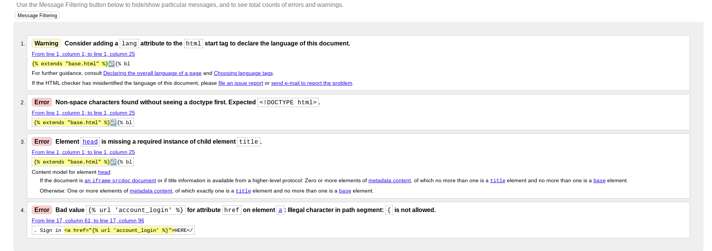
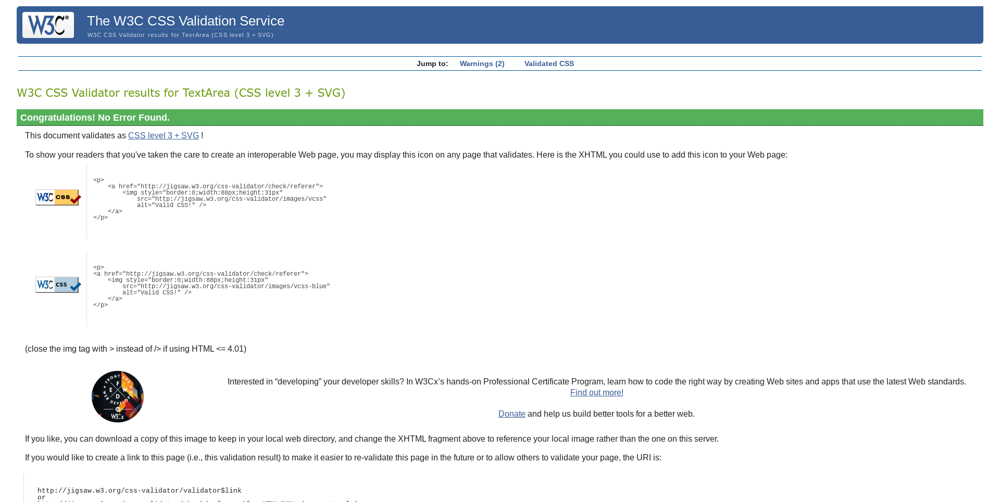
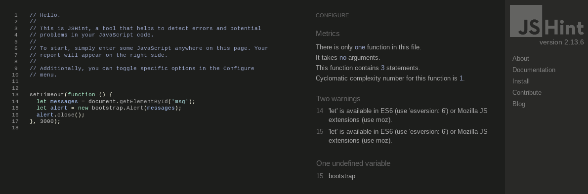
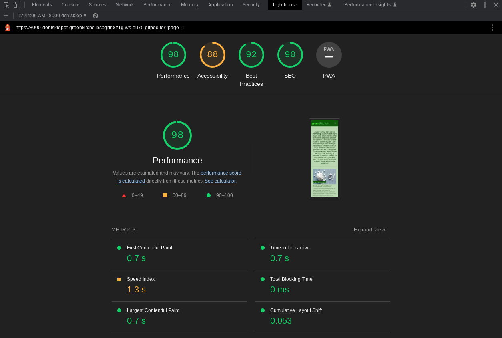
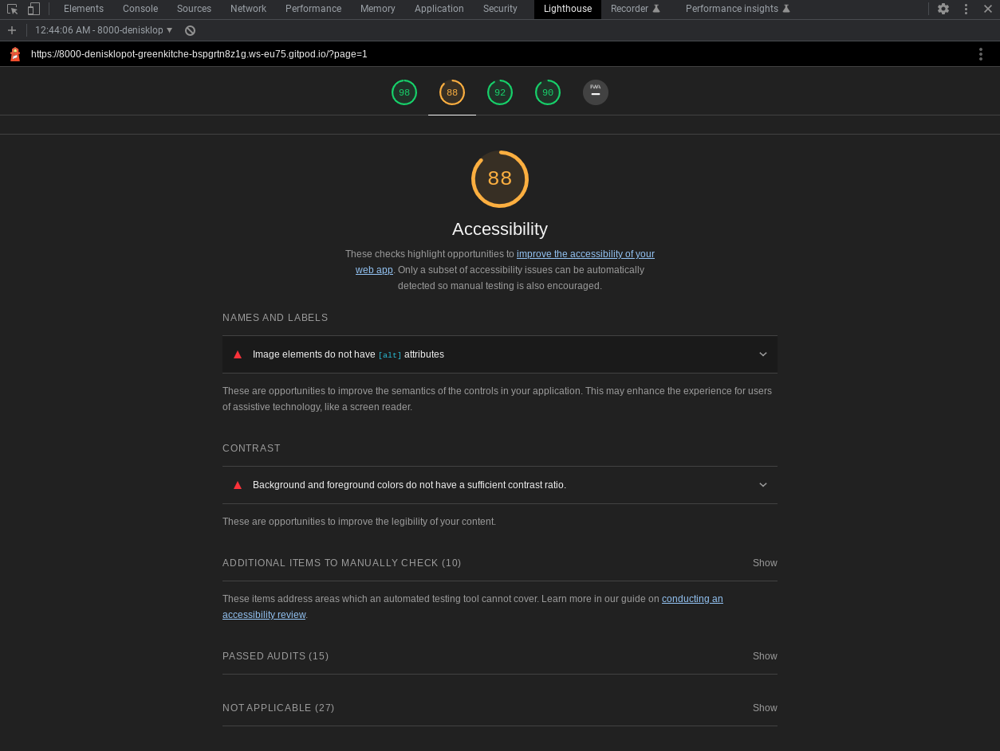
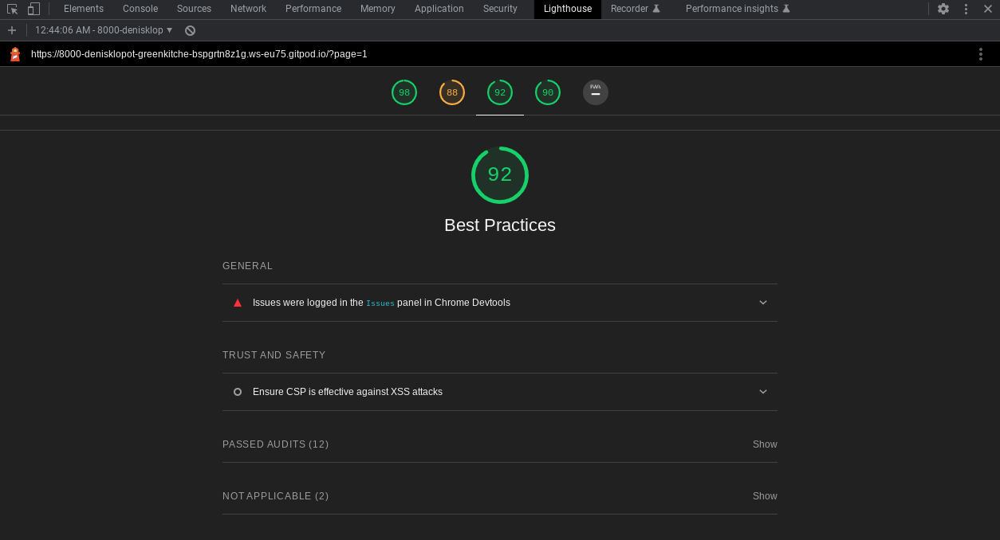
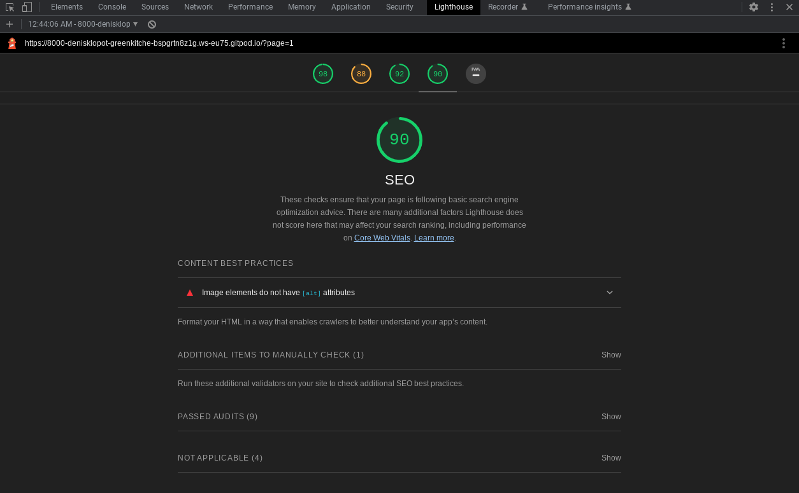
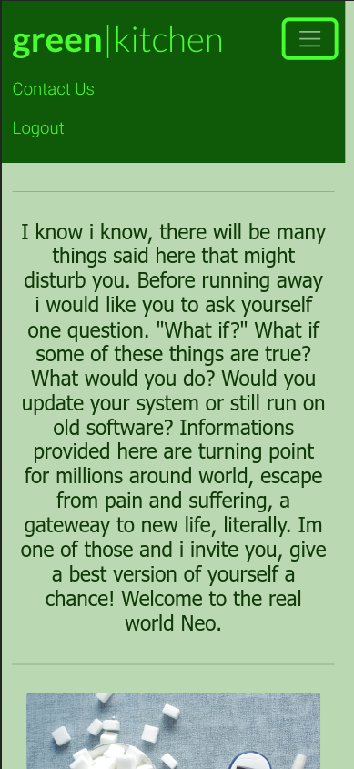
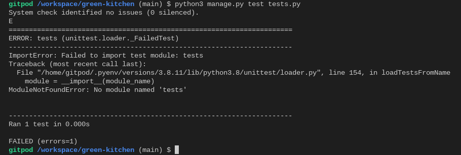

# Testing - Green Kitchen

## Table of contents

1. [Validator Testing](#Validator-Testing)
    - [HTML](#HTML)
    - [CSS](#CSS)
    - [JavaScript](#JavaScript)
    - [Python](#Python)
    - [Lighthouse](#Lighthouse)
2. [Browser Testing](#Browser-Testing)
3. [Device Testing](#Device-Testing)
4. [Manual Testing](#Manual-Testing)
5. [Unit Testing](#Unit-Testing)
6. [Bugs](#Bugs)

## Validator Testing
### HTML

Due to Django template extending most of html files trow following errors which we could not unfortunately fix at this moment.

Also, there are errors caused by the installed Summernote library which runs when using the form on these pages, which could not be fixed also.
Other than that html files are functional.

### CSS

No errors were found when passing through the official (Jigsaw) validator

### JavaScript

No errors were found when passing through Jshint, 2 version warnigs are shown.

### Python

I found that pep8 validator was discontinued so any python testing will need to be performed when appropriate tool is found. Thank you for understanding!

### Lighthouse

Lighthouse scores:

Accesibility

Seo

Best Practices

## Browser Testing

Aplication was tested on Chrome and Brave web browser and behaves properly and is responsive.

## Device Testing

Application was tested on multiple desktop and mobile devices like lenovo chromebook and Google pixel 6 pro and using Chrome developer tools. Testing showed website behaves properly.

## Manual Testing

Website was manually tested for all CRUD operations and user actions. Navigating trough the website, opening links, filling contact form, login / register / logout functions all work properly which can be seen from 'Features' section of readme.md file.

## Unit Testing

## Bugs

Media links or icons are currently just decorative, will add links in the future.